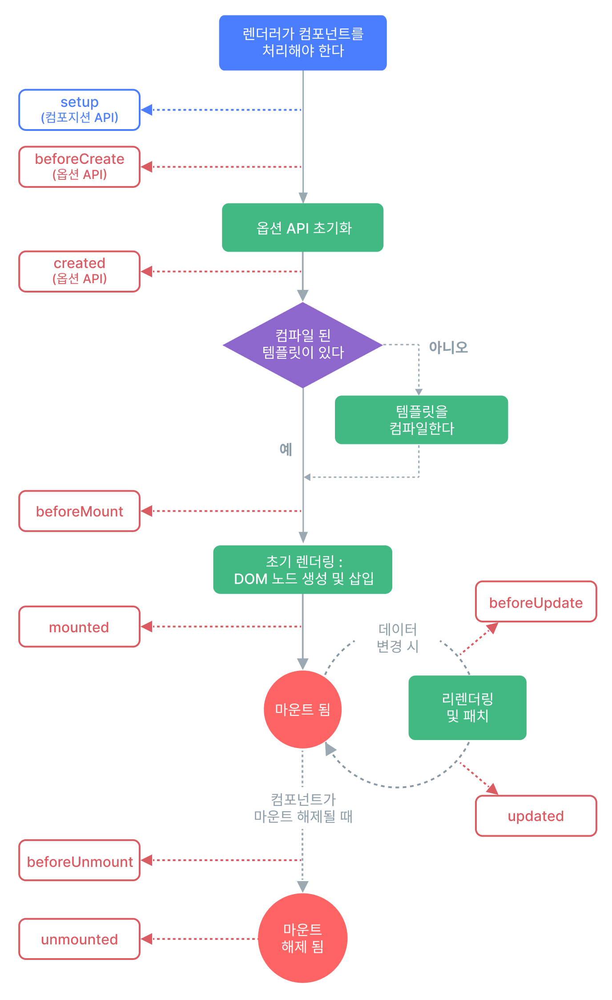

## 라이프 사이클 훅에서 실행순서
```vue
<script>
import { onBeforeMount, onMounted } from 'vue'
export default {
  setup() {
    console.log('setup')
    onBeforeMount(() => {
      console.log('onBeforeMount')
    }),
    onMounted(() => {
      console.log('onMounted')
    })
    return {}
  },
}
</script>
```

## 라이프 사이클 훅에서 dom 접근
```vue
<template>
  <input type="text" ref="inputRef" value="inputValue11" />
</template>

<script>
import { onBeforeMount, onMounted, ref } from 'vue'
export default {
  setup() {
    console.log('setup')
    const inputRef = ref(null)
    //접근 불가
    //console.log(inputRef.value._value)

    onBeforeMount(() => {
      console.log('onBeforeMount')
    }),
      onMounted(() => {
        console.log('onMounted')
        console.log(inputRef.value._value)
        console.log(inputRef.value.type)
      })
    return { inputRef }
  },
}
</script>
```

## 부모, 자식간 실행 순서
부모
```vue
<template>
  <input type="text" ref="inputRef" value="inputValue11" />
  <AppLifecycleHooksChild />
</template>

<script>
import { onBeforeMount, onMounted, ref } from 'vue'
import AppLifecycleHooksChild from './AppLifecycleHooksChild.vue'
export default {
  components: {
    AppLifecycleHooksChild,
  },
  setup() {
    console.log('setup')    
    onBeforeMount(() => {
      console.log('onBeforeMount')
    }),
      onMounted(() => {
        console.log('onMounted')        
      })
    return { inputRef }
  },
}
</script>
```
자식
```vue
<script>
import { onBeforeMount, onMounted } from 'vue'
export default {
  setup() {
    onBeforeMount(() => {
      console.log('child onBeforeMount')
    }),
      onMounted(() => {
        console.log('child onMounted')
      })
    return {}
  },
}
</script>
```
onBeforeUpdate vs onUpdated 차이
예제1. 공통 반응형 상태 선언 후 브라우저에서 값 변경 후 실행 확인
```vue
<script>
import {onBeforeUpdate, onUpdated,ref} from 'vue'
export default{
  setup(){
    onBeforeUpdate(()=>{
      console.log('onBeforeUpdate')
    }),
    onUpdated(()=>{
      console.log('onUpdated')
    })
  }
}
</script>
```

예제2 document.querySelector 로 가져올때 수정전과 수정 후 값 비교
onBeforeUpdate 은 dom 변경 전에 가져옴
onUpdated 은 dom 변경 후에 가져옴

```vue
<template>
  <div>
    <p id="message">{{ message }}</p>
  </div>
</template>
<script>
import { onBeforeUpdate, onUpdated, ref } from 'vue'
export default {
  setup() {
    const message = ref('message1')
    onBeforeUpdate(() => {
      console.log('onBeforeUpdate')
      console.log(message.value)
      console.log(document.querySelector('#message').textContent)
    })
    onUpdated(() => {
      console.log('onUpdated')
      console.log(message.value)
      console.log(document.querySelector('#message').textContent)
    })
    return { message }
  },
}
</script>
```

예제3 라이프 사이클 훅에서 
dom 에 접근할 수 있는지 없는지를 예측할 수 있어여함

```vue
<template>
  <div>
    <button type="button" @click="visible = !visible">토글</button>
    <AppLifecycleHooksChild v-if="visible" />
  </div>
</template>
<script>
import { ref } from 'vue'
import AppLifecycleHooksChild from './AppLifecycleHooksChild.vue'
export default {
  components: {
    AppLifecycleHooksChild,
  },
  setup() {
    const visible = ref(true)
    return { visible }
  },
}
</script>
```

```vue
<template>
  <div>박스</div>
  <input type="text" id="input" />
</template>
<script>
import { onBeforeMount, onBeforeUnmount, onMounted, onUnmounted } from 'vue'
export default {
  setup() {
    onBeforeMount(() => {
      console.log('마운트 전')
      console.log(document.querySelector('#input'))
    }),
      onMounted(() => {
        console.log('마운트 후')
        console.log(document.querySelector('#input'))
      }),
      onBeforeUnmount(() => {
        console.log('컴포넌트를 숨깁니다.')
        console.log(document.querySelector('#input'))
      })
    onUnmounted(() => {
      console.log('컴포넌트가 숨겨졌습니다.')
      console.log(document.querySelector('#input'))
    })
  },
}
</script>
```


## Lifecycle 다이어그램



## Lifecycle hooks 등록
```vue
<script setup>
import { onMounted } from 'vue'

onMounted(() => {
  console.log(`컴포넌트가 마운트 됐습니다.`)
})
</script>
```

## Lifecycle Hooks
컴포넌트 라이프 사이클의 각 단계에서 실행되는 함수들을 라이프사이클 훅이라고 합니다.

|Options API| setup 내부에서 사용 |
|:--|--:|
|beforeCreate |필요하지 않음| 
|created |필요하지 않음| 
|beforeMount |onBeforeMount| 
|mounted |onMounted| 
|beforeUpdate |onBeforeUpdate| 
|updated |onUpdated| 
|beforeUnmount |onBeforeUnmount| 
|unmounted |onUnmounted| 
|errorCaptured |onErrorCaptured| 
|renderTracked |onRenderTracked| 
|renderTriggered |onRenderTriggered| 
|activated |onActivated| 
|deactivated |onDeactivated| 
|serverPrefetch |	onServerPrefetch| 

## 라이프 사이클 훅 
Creation(생성) → Mounting(장착) → Updating(수정) → Destruction(소멸)

## Creation
컴포넌트 초기화 단계이며 `Creation Hooks`은 라이프사이클 단계에서 가장 먼저 실행된다. 

- 아직 컴포넌트가 DOM에 추가되기 전이므로 DOM에 접근할 수 없다.
- 서버렌더링에서 지원되는 단계
- 클라이언트나 서버 렌더 단에서 처리해야 할 일이 있으면 이 단계에서 진행

### beforeCreate
컴포넌트 인스턴스가 초기화 될 때 실행됩니다. data() 또는 computed와 같은 다른 옵션을 처리하기 전에 즉시 호출됩니다.

### created
컴포넌트 인스턴스가 초기화를 완료한 후 호출되는 훅 입니다.
### setup
Composition API의 `setup()` 훅은 Options API 훅 보다 먼저 호출됩니다.

`beforeCreate`와 `created` 라이프사이클 훅은 Options API에서 사용하는 라이프사이클 훅으로 Vue3 Composition API를 활용하여 개발을 진행할 때는 `setup()`함수로 대체할 수 있습니다.


```vue
<template>
  <div></div>
</template>

<script>
export default {
  setup() {
    console.log('setup')
    return {}
  },
  data: () => ({
    dataMessage: 'data message',
  }),
  beforeCreate() {//접근 불가능
    console.log('beforeCreated', this.dataMessage)
  },
  created() {//접근 가능
    console.log('created', this.dataMEssage)
  },
}
</script>
```

## Mounting
DOM에 컴포넌트를 삽입하는 단계이다. `onBeforeMount`와 `onMounted`가 있다.

- 서버렌더링에서 지원되지 않는다
- 초기 렌더링 직전에 돔을 변경하고자 한다면 이 단계에서 활용할 수 있다

### onBeforeMount

컴포넌트가 마운트되기 직전에 호출됩니다.

- 대부분의 경우 사용을 권장하지 않는다

### onMounted

컴포넌트가 마운트된 후에 호출됩니다. DOM에 접근할 수 있습니다.

- 모든 자식 컴포넌트가 마운트되었음을 의미합니다.
- 자체 DOM 트리가 생성되어 상위 컴포넌트에 삽입되었음을 의미합니다.

## Updating

반응형 상태 변경으로 컴포넌트의 DOM 트리가 업데이트된 후 호출될 콜백을 등록합니다.

- 디버깅이나 프로파일링 등을 위해 컴포넌트 재 렌더링 시점을 알고 싶을 때 사용하면 된다.

``


### onBeforeUpdate

반응형 상태 변경으로 컴포넌트의 DOM 트리를 업데이트하기 직전에 호출될 콜백을 등록합니다.

컴포넌트에서 사용되는 반응형 상태 값이 변해서, DOM에도 그 변화를 적용시켜야 할 때가 있습니다. 이 때, 변화 직전에 호출되는 것이 바로 onBeforeUpdate 훅입니다.


### onUpdated

반응 상태 변경으로 인해 컴포넌트가 DOM 트리를 업데이트한 후에 호출됩니다.

상위 컴포넌트의 `onUpdated`훅은 하위 컴포넌트의 훅 이후에 호출됩니다. (`Child` → `Parent`)

이 훅은 다른 상태 변경으로 인해 발생할 수 있는 컴포넌트의 DOM 업데이트 후에 호출됩니다. 특정 상태 변경 후에 업데이트된 DOM에 액세스해야 하는 경우 대신 `nextTick()`을 사용하십시오.

> **WARNING**
`onUpdated` 훅에서 컴포넌트 상태를 변경하지 마십시오. 그러면 무한 업데이트 루프가 발생할 수 있습니다!
>

## **Destruction**

해체(소멸)단계 이며 `onBeforeUnmount`와 `onUnmounted`가 있습니다.

### onBeforeUnmount
컴포넌트가 마운트 해제되기 직전에 호출됩니다.

### onUnmounted
컴포넌트가 마운트 해제된 후 호출됩니다.

### onBeforeUnmount
컴포넌트가 마운트 해제되기 직전에 호출됩니다.

### onUnmounted
컴포넌트가 마운트 해제된 후 호출됩니다.

## ETC
- [**`onErrorCaptured()`**](https://vuejs.org/api/composition-api-lifecycle.html#onerrorcaptured)
- [**`onRenderTracked()`**](https://vuejs.org/api/composition-api-lifecycle.html#onrendertracked)
- [**`onRenderTriggered()`**](https://vuejs.org/api/composition-api-lifecycle.html#onrendertriggered)
- [**`onActivated()`**](https://vuejs.org/api/composition-api-lifecycle.html#onactivated)
- [**`onDeactivated()`**](https://vuejs.org/api/composition-api-lifecycle.html#ondeactivated)
- [**`onServerPrefetch()`**](https://vuejs.org/api/composition-api-lifecycle.html#onserverprefetch)

## Composition API Lifecycle
